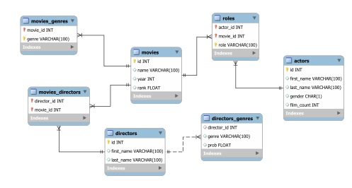
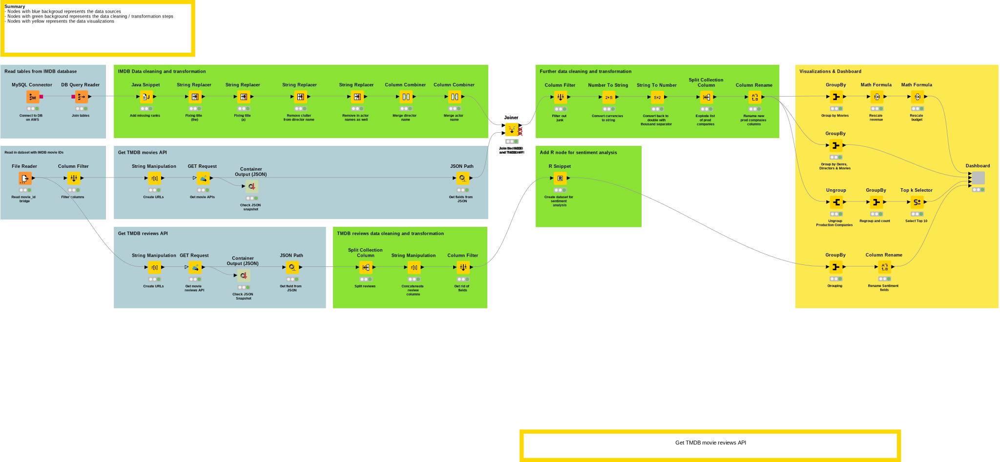

## Movies analysis

## Table of Contents  
1. [Overview](#Overview)  
2. [Data Sources](#Data_sources)  
3. [ETL](#ETL)  
4. [Analytical question](#Analytical_questions)  
5. [Visualizations](#Visualizations)  

<!-- ----------------------------------------------------------------------------------------------------------------------------------------------------------------------- -->
<!-- OVERVIEW--------------------------------------------------------------------------------------------------------------------------------------------------------------- -->
<!-- ----------------------------------------------------------------------------------------------------------------------------------------------------------------------- -->

<a name="Overview"/>

## Overview

In the second term project, we decided to continue with the analysis on movies and extend the [IMDB database](https://relational.fit.cvut.cz/dataset/IMDb) with other external data sources. The IMDB dataset contains detailed information about the movies, directors and actors but lacks data about the budget, the duration of the movies and do not contain textual data about the movie reviews. Therefore, we decided to enrich our database using [TheMovieDB‘s API](https://developers.themoviedb.org/3/getting-started/introduction) which allows access to one of the biggest user editable databases for movies and TV shows.

<!-- ----------------------------------------------------------------------------------------------------------------------------------------------------------------------- -->
<!-- DATA SOURCES ------------------------------------------------------------------------------------------------------------------------------------------------------------ -->
<!-- ----------------------------------------------------------------------------------------------------------------------------------------------------------------------- -->

<a name="Data_sources"/>

## Data Sources

### IMDB Database

Once again, we chose to work with a relational dataset on IMDb data, because it was somewhat limited, thereby easier to expand it with other API sources. A small sample of the data was retrieved from a public MariaDB instance (considering the size of our virtual machine and the goal of this project) and ingested in bulk with a custom `Shell` script in our `MySQL` instance. Sonny was responsible for ingesting the data. The Snowflake schema of the relational database can be best-described with the following `ERD` diagram.

Additional parameters of the dataset

- 36 distinct movies
- 1907 actors
- 34 directors
- 16 genres
- 1695 roles
- from 20 different years

Our `MySQL` instance was hosted on `AWS’ RDS service` (under a Free Tier subscription with the smallest machine). For setting up connection, we had allowed every incoming `IP addresses` through the firewall when defining `Security Groups`. Viki was the one who managed these resources and initialized the necessary infrastructure.

### TMDb API

To complement the IMDb database, we made `GET` request to the `public v3 API` of `TheMovieDB`. The `TMDb API` is a resource for any developers that want to integrate movie, TV show and cast data along with posters or movie fan art. [themoviedb.org](https://www.themoviedb.org) is a free and community edited database. We have used the key requested by Viki to get our responses. The necessary URL strings were generated within Knime. For more, check out the [API documentation](https://www.themoviedb.org/documentation/api).

<!-- ----------------------------------------------------------------------------------------------------------------------------------------------------------------------- -->
<!-- ETL ------------------------------------------------------------------------------------------------------------------------------------------------------------------- -->
<!-- ----------------------------------------------------------------------------------------------------------------------------------------------------------------------- -->

<a name="ETL"/>

## ETL in Knime

### Ingestion

We used the `MySQL Connector` node to pull in data from our AWS instance and the `DB Query Reader` to denormalize our schema.

### Data Cleaning Process

- A small `Java snippet` was used to fix missing rank values for movies such as `Batman Begins` and `Pirates of the Caribbean`. 
- We noticed that there are inconsistencies in the naming of movies, such as stop words being at the end of the names, separated with commas. (e.g. Godfather, The). 
- After that, we also wanted to simplify the names of the actors and directors as there were a lot of family titles included in their names, so we cleaned them. 
- To reduce the number of columns required for extracting actor and director information, we merged first, and last names separated in the raw IMDb dataset.
- We treated the issue of multiple movies remakes by string concatenating the production years with the movie titles.

### API Requests

- We used a `File Reader` node to retrieve the mapping `csv` between our two data sources. 
- Next we generated `GET` Request URLs for each movie IDs via `String Manipulation` and stored responses as `JSON` objects
- Having all that, we extracted the necessary `JSON` values as separate columns such as the `budget`, `revenue`, `runtime`, `reviews` etc. of the movies.

### Post-transformations

- We inner-joined our two data sources and filtered out the unnecessary columns, such as redundant identifiers coming from different tables.
- Converted currencies for clarity to double formats having thousands separators
- Exploded the list of production companies per movies to separate columns.

<!-- ----------------------------------------------------------------------------------------------------------------------------------------------------------------------- -->
<!-- ANALYTICAL QUESTION---------------------------------------------------------------------------------------------------------------------------------------------------- -->
<!-- ----------------------------------------------------------------------------------------------------------------------------------------------------------------------- -->

<a name="Analytical_questions"/>

## Analytical questions

<!-- ----------------------------------------------------------------------------------------------------------------------------------------------------------------------- -->
<!-- VISUALIZATIONS ---------------------------------------------------------------------------------------------------------------------------------------------------- -->
<!-- ----------------------------------------------------------------------------------------------------------------------------------------------------------------------- -->

<a name="Visualizations"/>

## Visualizations
