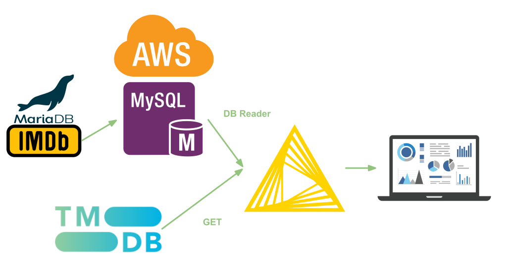
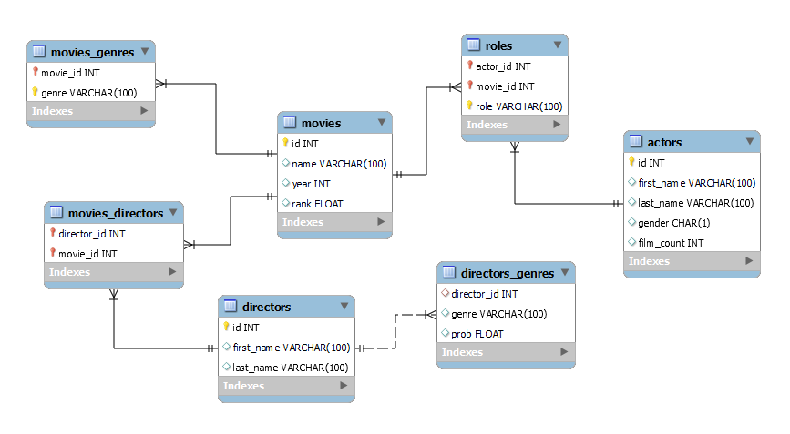
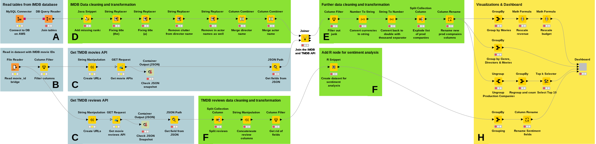

## Movies analysis

## Table of Contents  
1. [Overview](#Overview)  
2. [Data Sources](#Data_sources)  
3. [KNIME Workflow](#Knime)  
4. [Analytical question](#Analytical_questions)  
5. [Visualizations](#Visualizations)  
6. [Tasks and responsibilities](#Responsibilities)  

<!-- ----------------------------------------------------------------------------------------------------------------------------------------------------------------------- -->
<!-- OVERVIEW--------------------------------------------------------------------------------------------------------------------------------------------------------------- -->
<!-- ----------------------------------------------------------------------------------------------------------------------------------------------------------------------- -->

<a name="Overview"/>

## Overview

In the second term project, we decided to continue with the analysis on movies and extend the [IMDB database](https://relational.fit.cvut.cz/dataset/IMDb) with other external data sources. The IMDB dataset contains detailed information about the movies, directors and actors but lacks data about the budget, the duration of the movies and do not contain textual data about the movie reviews. Therefore, we decided to enrich our database using [TheMovieDB‘s API](https://developers.themoviedb.org/3/getting-started/introduction) which allows access to one of the biggest user editable databases for movies and TV shows.

<!-- ----------------------------------------------------------------------------------------------------------------------------------------------------------------------- -->
<!-- DATA SOURCES ------------------------------------------------------------------------------------------------------------------------------------------------------------ -->
<!-- ----------------------------------------------------------------------------------------------------------------------------------------------------------------------- -->

<a name="Data Pipeline"/>

Our data pipeline looks as follows. Firstly, had our source IMDb dataset extracted from MariaDB and loaded into a MySQL instance on [AWS](https://docs.aws.amazon.com/AmazonRDS/latest/UserGuide/CHAP_GettingStarted.CreatingConnecting.MySQL.html). Secondly, our external source was coming from the ‘TheMovieDB’s (TMDb) API. Our general idea was to enrich the slim data included in the IMDb sample with columns such as runtime, production company, etc. Unfortunately, the mapping between identifiers between both data sources were not matching, therefore, we manually wrangled the IDs of the IMDb dataset to match with the API source.

When all things were in place, we dropped KNIME on top of the MySQL database, while sending a GET Request to the TMDb API.

<a name="Data_sources"/>

## Data Sources

### IMDB Database

We chose to work with a relational dataset on IMDb data, because it was somewhat limited, thereby easier to expand it with other API sources. A small sample of the data was retrieved from a public MariaDB instance (considering the size of our virtual machine and the goal of this project) and ingested in bulk with a custom Shell script in our MySQL instance. The Snowflake schema of the relational database can be best-described with the following ERD diagram.

- 36 distinct movies
- 1907 actors
- 34 directors
- 16 genres
- 1695 roles
- from 20 different years

  

Our MySQL instance was hosted on AWS’ RDS service (under a Free Tier subscription with the smallest machine). For setting up connection, we had allowed every incoming IP addresses through the firewall when defining Security Groups.

### TMDb API

To complement the IMDb database, we created GET requests to the public v3 API of TheMovieDB. The TMDb API is a resource for any developers who want to integrate movie, TV show and cast data along with posters or movie fan art. We have requested an API key to get our responses. 

A sample TMDb API request looks like the following:
`https://api.themoviedb.org/3/movie/{movie_id}?api_key=<<api_key>>&language=en-US`
Where the two required parameters are the movie_id, which is the TMDb’s unique identifier of the movies and the api_key.

In order to get the responses for all movies in our dataset, the necessary URL strings were generated within KNIME.

<!-- ----------------------------------------------------------------------------------------------------------------------------------------------------------------------- -->
<!-- ANALYTICAL QUESTION---------------------------------------------------------------------------------------------------------------------------------------------------- -->
<!-- ----------------------------------------------------------------------------------------------------------------------------------------------------------------------- -->

<a name="Analytical_questions"/>

## Analytical questions

- **How much revenue did each movie make compared to the production budget? Can we identify movies with substantially higher revenues than the rest?**
- **Which are the different genres of movies that each director has worked on?**
- **Which are the top production companies in terms of movies produced?**
- **What is the general sentiment about the movies based on it’s reviews?**

<!-- ----------------------------------------------------------------------------------------------------------------------------------------------------------------------- -->
<!-- ETL ------------------------------------------------------------------------------------------------------------------------------------------------------------------- -->
<!-- ----------------------------------------------------------------------------------------------------------------------------------------------------------------------- -->

<a name="Knime"/>

## KNIME Worfklow

The following chart summarizes the whole workflow of our data product. The colored boxes indicate the type of the operation that the nodes included in the box do. We differentiated between the following phases: loading data sources (blue), data transformation and cleaning (green) and visualization (yellow).

### Data Ingestion (A)

We used the `MySQL Connector` node to pull in data from our AWS instance and the `DB Query Reader` to denormalize our schema.

### Reading data from flat file (B)
A csv file containing the TMDb movie_id-s and the titles of the movies was read from our GitHub folder with a File Reader node.

### API Requests (C)

Two API requests were created for each movie: the first response included primary information about the movie (such as the budget and the runtime), while the second response had textual data about the movie reviews.

- In both cases, we used a File Reader node to retrieve the mapping csv between our two data sources. 
- Next, we generated GET Request URLs for each movie IDs via String Manipulation and stored responses as JSON objects
- Having all that, we extracted the necessary JSON values as separate columns such as the budget, revenue, runtime, reviews etc. of the movies.

### Data Cleaning of the IMDb Database (D)

- A small Java snippet was used to fix missing rank values for movies such as Batman Begins and Pirates of the Caribbean. 
- We noticed that there are inconsistencies in the titles of the movies, such as articles being after nouns, separated with commas. (e.g. Godfather, The). 
- After that, we also wanted to simplify the names of the actors and directors as there were a lot of family titles included in their names, so we cleaned them.
- To reduce the number of columns required for extracting the actor and director information, we merged first, and last names separated in the raw IMDb dataset.

### Data Cleaning of the TMDb Reviews Data (F)

In case of the IMDb movie reviews response, further transformations were needed to prepare the textual data for analysis:

As reviews were queried in a list, the elements of the list needed to be converted to string and concatenated into one string field.

### Post-transformations (E)

After the IMBD and the TMDb data sources were inner joined, further transformations were needed:

- We filtered out the unnecessary columns, such as redundant identifiers coming from different tables.
- We converted the currencies for clarity to double formats, with having thousands separators
- Also, we broke up the list of production companies per movie to both separate row and columns for further visualization

### R Snippet (G)

We decided to implement a very basic, dictionary based sentiment analysis with the movie reviews retrieved also from the TMDb database. For this analysis, we enriched our workflow with an R Snippet.

- The input of the analysis was the textual data from the movie reviews.
- To decide whether words in the reviews have positive or negative sentiments, we used a sentiment dictionary built into R’s tidytext package called ‘bing’. The dictionary includes sentiment words identified on online forums and their classification into ‘positive’ or ‘negative’ sentiment categories. 
- For this, the dataset with the movie titles and reviews first needed to be transformed into a format, where each word of the reviews are in a separate rows. This transformation was done within the R Snippet node using the tidytext package.
- After the dataset was transformed into the proper format, the sentiment of each word was assessed based on the sentiment dictionary: words with negative sentiment were assigned -1 and words with positive sentiment were assigned +1. We used the output of this operation for visualization.
- As the transformation drastically increased the rows of the dataset, we decided to keep the output dataset used for this analysis separately from the rest of the data pipeline. 

*Please note that the following KNIME extension and R packages needs to be installed in order to execute the ‘R snippet’ node:*
- *KNIME extension: Interactive R Statistics Integration*
- *R packages: dplyr, Rserve, tidytext*

<!-- ----------------------------------------------------------------------------------------------------------------------------------------------------------------------- -->
<!-- VISUALIZATIONS ---------------------------------------------------------------------------------------------------------------------------------------------------- -->
<!-- ----------------------------------------------------------------------------------------------------------------------------------------------------------------------- -->

<a name="Visualizations"/>

## Visualizations

At the final stage of our data pipeline, we created visualizations that helps to answer our analytical questions. 

Four visualizations were created which were later integrated into an interactive dashboard. In this section, we discuss each visual separately and draw conclusions from them.

### 1. Movies by Revenues & Budgets (How much revenue did each movie make compared to the production budget?)

In order to answer this question, a few further nodes were added to display the required information in a visual. First, a group by node was added to group data by movies. Since both revenues and budgets were mainly in a million, two additional nodes of math formula were added to rescale both the values. For the final stage, a stacked bar chart was used to show the comparison. As it is clearly visible from the chart, the revenues from Titanic leads the way with more than 2 billion dollars.

  

### 2. Directors by Genres (What are the different genres of movies that each director has worked on?)

The calculation for the answer of this question was rather straightforward. A group by node was used to group directors by genres. To display this information, a sunburst chart was used since it allows interactions required to explain this chart when presenting it. Which means you filter directors based on genres.As per the chart, there are few directors who have worked with multiple genres.

  

### 3. Movies per Production House (How many movies did each production house produce?)

Each movie tends to have more than one production house in the dataset. Therefore, to answer this question, an ungroup node followed by a Groupby node was used to include all the production houses that have worked on any of the movies in the data. Since the majority of the production houses had only worked with one to two movies, we decided to include only the top 10 production houses (production houses with most movies). To do this, a Top k selector node was added to filter top 10 production houses which were then added to the bar chart node for visualisation. 

  

### 4. Sentiment Analysis (What is the general sentiment about the movies based on it’s reviews?)

Finally, we have added a visualization of the identified sentiment words in the reviews. For this, we used the output of the R node with the positive and negative words. The below chart shows the distribution of these words across movies. 

  

<!-- ----------------------------------------------------------------------------------------------------------------------------------------------------------------------- -->
<!-- RESPONSIBILITIES--------------------------------------------------------------------------------------------------------------------------------------------------------------- -->
<!-- ----------------------------------------------------------------------------------------------------------------------------------------------------------------------- -->

<a name="Responsibilities"/>

## Tasks and responsibilities

| Task | Who? |
|---|---|
| Creation of MySQL instance on AWS’ RDS service  | Viki & Sonny  |
| IMDb data ingestion  |  Sonny |
| Connecting API source  | Viki  |
| Data cleaning and complex transformations  | Beni & Sonny  |
| Adding R Extension  | Viki |
| Data visualizations and dashboard  | Ali |
| Documentation | Sonny, Ali, Beni & Viki |

